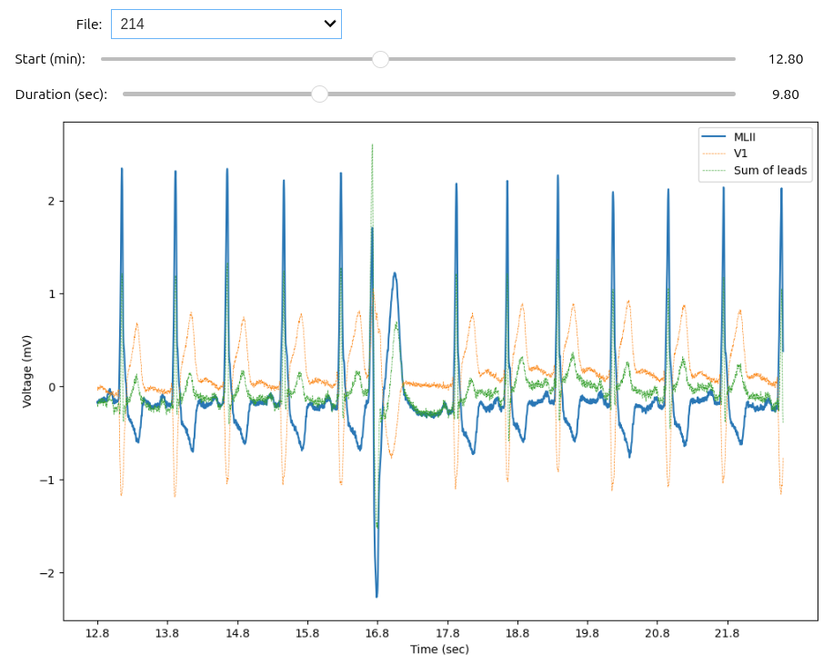

# ECG Analysis (30)

The objective of this homework is to practice what we have learned so far with Git, 
GitHub and Python, and apply it to analyze 2-lead electrocardiogram data. 
For the first two questions, please write your answers in a file called `Answers.py`. 


# File exploration (5 pts)
1. Make a function called `record_reader` that receives a **path to a folder** that contains a list of 
ECG records (hea), and returns a list of sorted record files and a list with the corresponding
ECGRecord object. 

Example dictionary: (please use the same keys)

```python
output = {'record_files': ['file1.hea', 'file2.hea'],
          'record_objs':[ECGRecord1, ECGRecord1]}
```

# ECG analysis 1 (10 pts)
2. Make a function called `heart_beats_summary` that receives one **ECGRecord**  
and returns in a dictionary the number of detected heart beats (all labels except '+'), its mean
heart rate in bpm (again considering all detected labels and just save the closest integer value), 
and the percentage of normal heart beats (labeled with 'N') 
Example dictionary (please use the same keys):
```python
output = {'heart_beats': 303,
          'mean_heart_rate': 80,
          'perc_normal_beats': .70
          }
```

# ECG analysis 2 (15 pts)
3. Make a Jupyter Noteboook that contains the following:
   1. A description of three heart disorder that can be identified using electrocardiograms. Some options: myocardial infarction, 
   long QT syndrome, ventricular tachycardia, atrial flutter, atrial fibrillation,
   wolff-parkinson-white syndrome. Please include a representative ECG image for each of the disorder being described.
   2. A widget that uses a list of hea files (previously loaded from a path pointing to a list of ECG files, like `test_folder/Data`)
   and allows the user to:
      1. Select with a **Dropdown** which file to open.
      2. Select with a **IntSlider** which location of the file to display.
      3. Select with a **IntSlider** the number of measurements to display. 
      4. Visualize the two leads and the addition of the two leads in a single plot. 

Examples:



