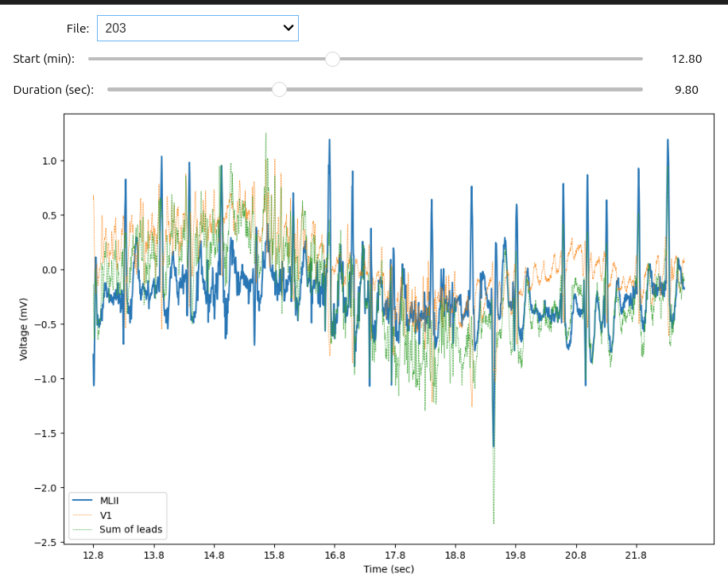
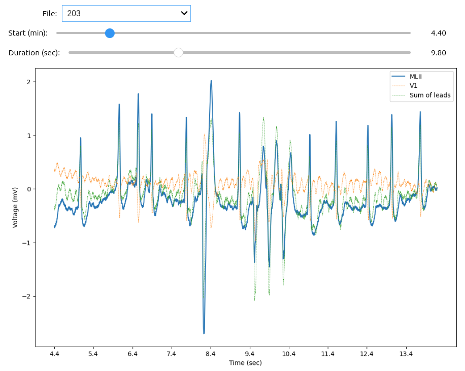

# ECG Analysis (40)

The objective of this homework is to practice what we have learned so far with Git, 
GitHub and Python, and apply it to analyze 2-lead electrocardiogram data. 

For this assignment you need to make a markdown report file called `report.md` with
 the answers to the questions below and the code you used to solve them. For the 
 auto-grading to work properly, all of your answers must be written in a file called 
 `answers_module.py` in the 'root' folder of this repo (except the last question).

# 1 Database description (10 pts)
Please provide a description and summary of the database used in this homework.
How many records are there? How many measurements per record? What is the sampling frequency? What are the symbols used in the annotations and what do they mean? 


# 2 File exploration (10 pts)
1. Make a function called `record_reader` that receives a **path to a folder** that contains a list of 
ECG records (hea files), and returns a list of dictionaries containing the record files and the corresponding `WFDB Record` and `WFDB Annotation` objects. 

In your report please describe the information contained in a `WFDB Record` and `WFDB Annotation` objects.

Example dictionary: (please use the same keys 'file_name',
 'record_obj' and 'annot_obj')

```python
output = [{'file_name':'file1',
            'record_obj':Record_obj_1,
            'annot_obj':Annotation_obj_1},
          {'file_name':'file2',
            'record_obj':Record_obj_2,
            'annot_obj':Annotation_obj_2}]
```

# 3 ECG analysis basics (10 pts)
2. Make a function called `heart_beats_summary` that receives one **WFDB Record**  
and returns in a dictionary:

* **heart_beats** --> the number of labeled *heart beats* (all labels except '+')
* **mean_heart_rate** -->  the mean heart rate in bpm $\frac{heart beats}{min}$, consider the sampling frequency and the time of the last record sample (`record.sample[-1]`).
* **perc_normal_beats** --> the percentage of normal heart beats (labeled with 'N')

Example dictionary (please use the same keys):

```python
output = {'heart_beats': 303,
          'mean_heart_rate': 80,
          'perc_normal_beats': .70
          }
```

# 4 ECG visualization (10 pts)
   Inside a **JupyterNotebook** file (not the same `answers_module.py`) create an Ipwidget that uses a list of hea files (previously loaded from a path pointing to a list of ECG files, like `test_folder/Data`)
   and allows the user to:

1. Select from a **Dropdown** which file to open.
2. Select with an **FloatSlider** which minute of the file to display.
3. Select with an **IntSlider** the number of seconds to display. 
4. Visualize the two leads and the sum of the two leads in a single plot. 

Examples of the widget (this widget doesn't have the proper conversion to minutes for the two sliders):





# 5 Extra ECG analysis (Extra 10 pts)
Include in your widget the corresponding label
assigned to each beat in the selected time interval.

Bellow is just an example, I'm sure you can do it better!

